# Organization Hierarchy — React App

A React + Vite application that displays organizational hierarchy with tree view and chart view. Designed to be embedded inside Oracle APEX.

## Features

- **Tree View** — Expandable tree with levels, designations, and employees
- **Hierarchy Chart** — Visual top-to-bottom org chart with clickable designation cards
- **Employee Details** — Click a designation to see all employees in a grid
- **Employee Redirect** — Click an employee to open their APEX profile page
- **Search** — Server-side search by name, ID, designation, or company
- **Pagination** — Load more support for large datasets
- **Responsive** — Mobile-friendly UI with touch support

---

## 1. Setup & Install

### Prerequisites

- **Node.js** v18 or higher ([download](https://nodejs.org/))
- **npm** (comes with Node.js) or **bun** ([download](https://bun.sh/))

### Clone & Install

```bash
# Clone the repository
git clone <your-repo-url>
cd my-react-app

# Install dependencies using npm
npm install

# OR using bun
bun install
```

### Run Development Server

```bash
# Start dev server with hot reload
npm run dev

# OR
bun run dev
```

The app will be available at `http://localhost:5173/`.

---

## 2. Build for Production

```bash
# Build the production bundle
npm run build

# OR
bun run build
```

This creates the `dist/` folder:

```
dist/
├── assets/
│   ├── index-XXXXXXXX.js    ← JavaScript bundle
│   └── index-XXXXXXXX.css   ← CSS stylesheet
├── index.html
└── vite.svg
```

> **Tip:** To get consistent filenames (no hash), update `vite.config.js`:
>
> ```js
> export default defineConfig({
>   plugins: [react()],
>   build: {
>     rollupOptions: {
>       output: {
>         entryFileNames: 'assets/app.js',
>         assetFileNames: 'assets/app.[ext]',
>       }
>     }
>   }
> })
> ```
>
> This produces `assets/app.js` and `assets/app.css` — no hash, so APEX file references never need updating.

---

## 3. Integrate into Oracle APEX

### Step 3.1 — Open Shared Components

Go to your APEX application → **Shared Components**.

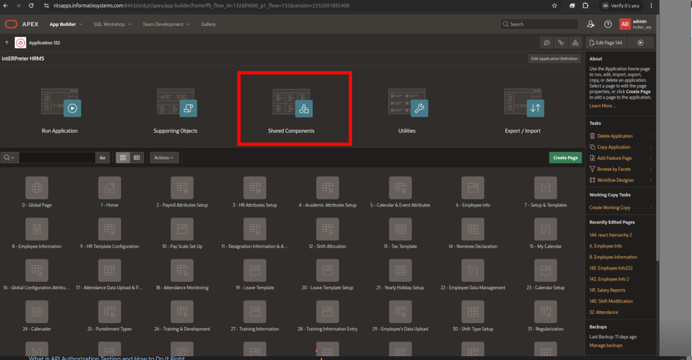

### Step 3.2 — Go to Static Application Files

Under **Files and Reports**, click **Static Application Files**.

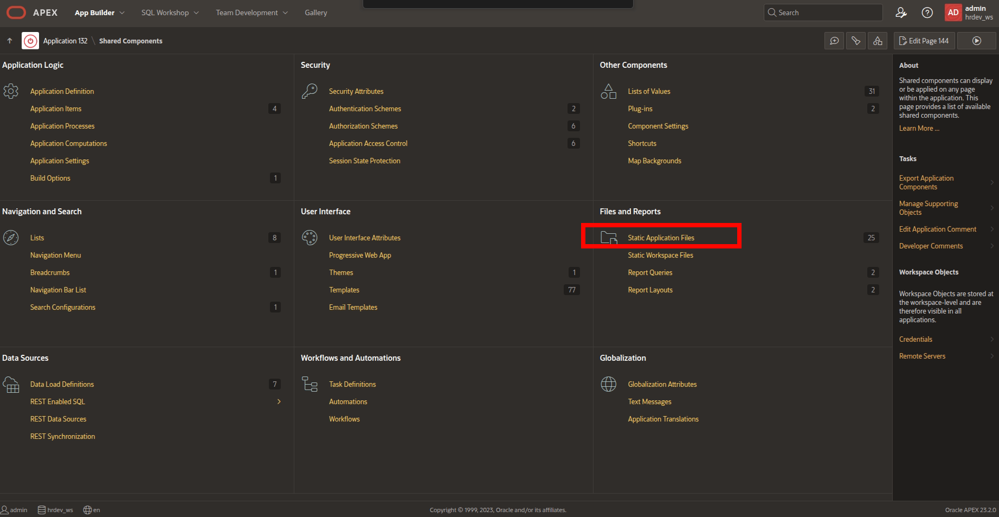

### Step 3.3 — Create a Static File

Click **Create File** to add a new static file.

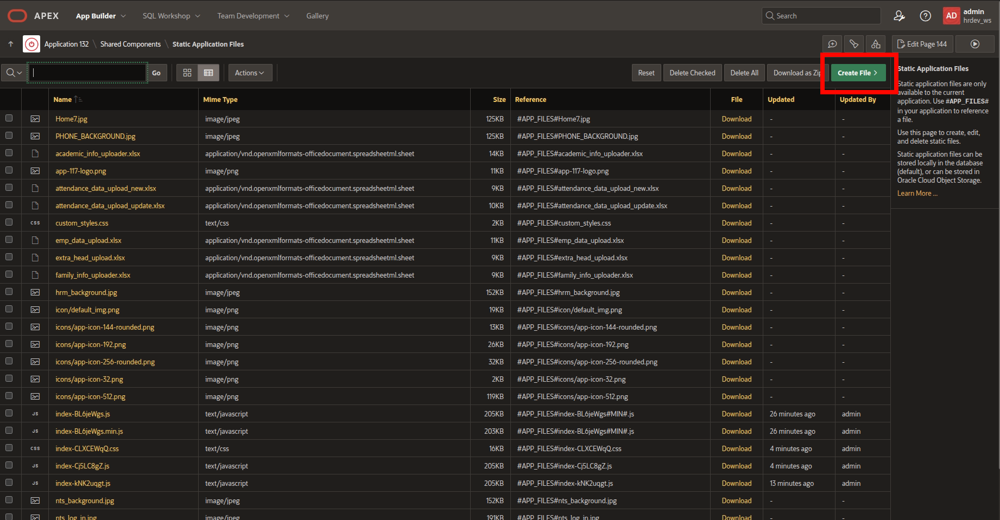

### Step 3.4 — Upload the JS File

Upload the JavaScript bundle from `dist/assets/`:

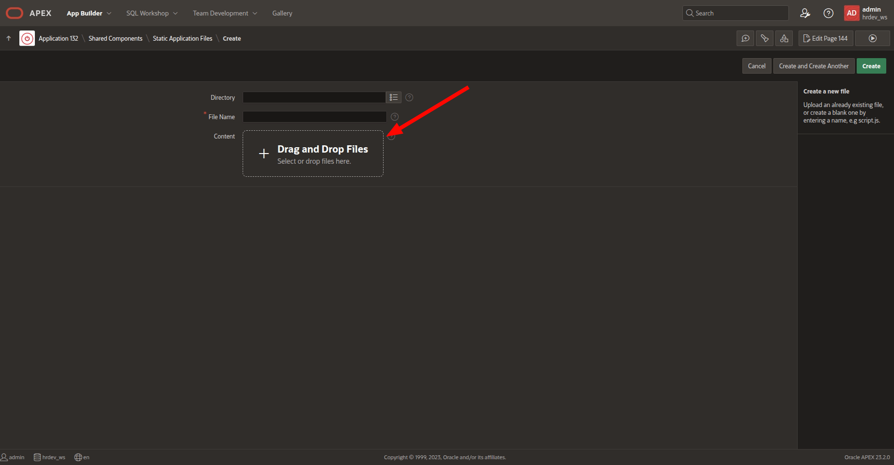

### Step 3.5 — Click Create

After selecting the JS file, click **Create** to upload it.

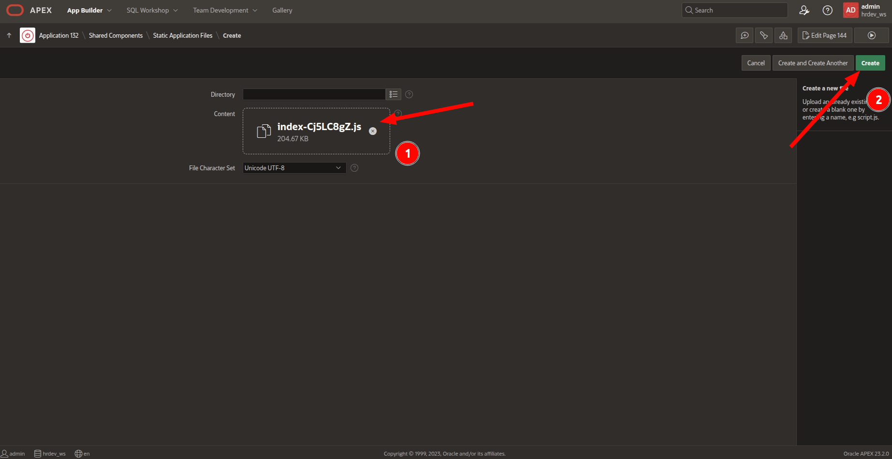

### Step 3.6 — Upload the CSS File

Similarly, upload the CSS file from `dist/assets/`:

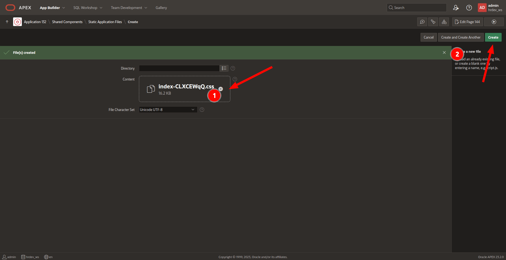

### Step 3.7 — Copy JS File Reference

Click the **Reference** icon next to the JS file to copy its path (e.g., `#APP_FILES#index-XXXXXXXX.js`).

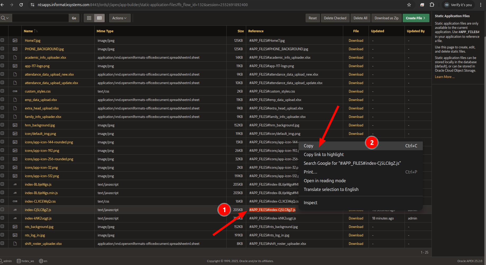

### Step 3.8 — Copy CSS File Reference

Click the **Reference** icon next to the CSS file to copy its path (e.g., `#APP_FILES#index-XXXXXXXX.css`).

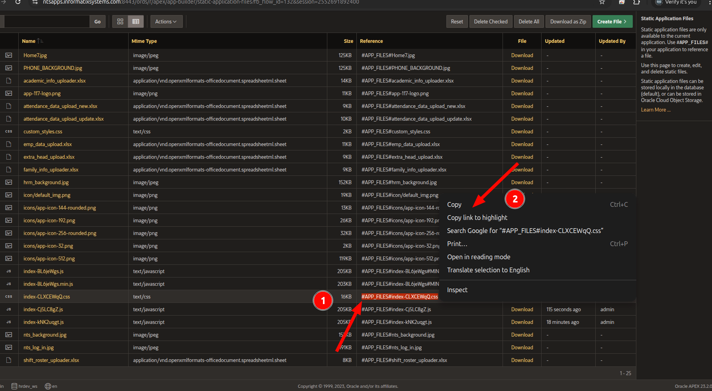

---

### Step 3.9 — Create a New APEX Page

Go to **App Builder** → your app → **Create Page** → **Blank Page**.

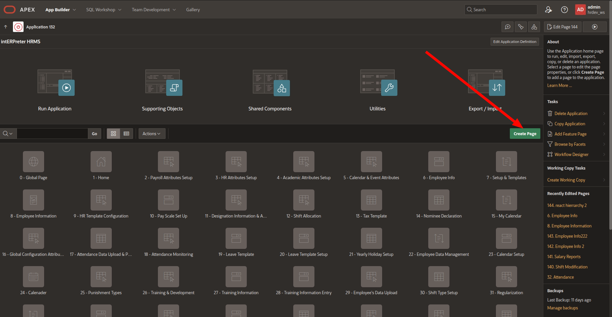

### Step 3.10 — Set Page Properties

Name the page (e.g., "Organization Hierarchy").

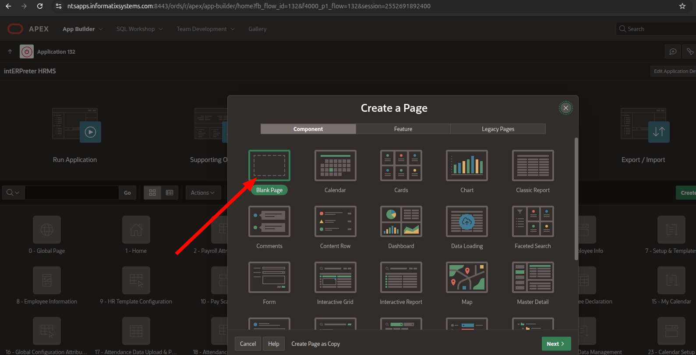

---

### Step 3.11 — Add a Static Content Region

In Page Designer, right-click **Body** → **Create Region**.

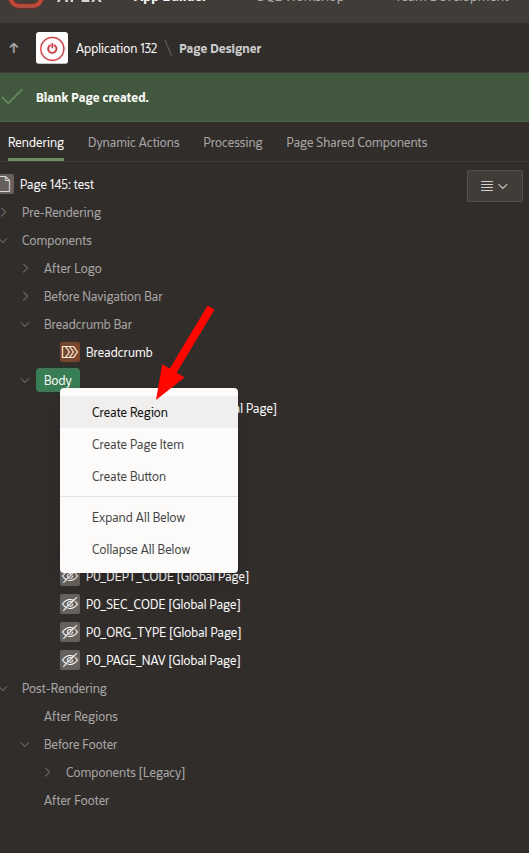

### Step 3.12 — Configure the Region

Set:

- **Type:** `Static Content`
- **Source > HTML Code:**

```html
<div id="root"></div>
```

This is where React mounts the app.

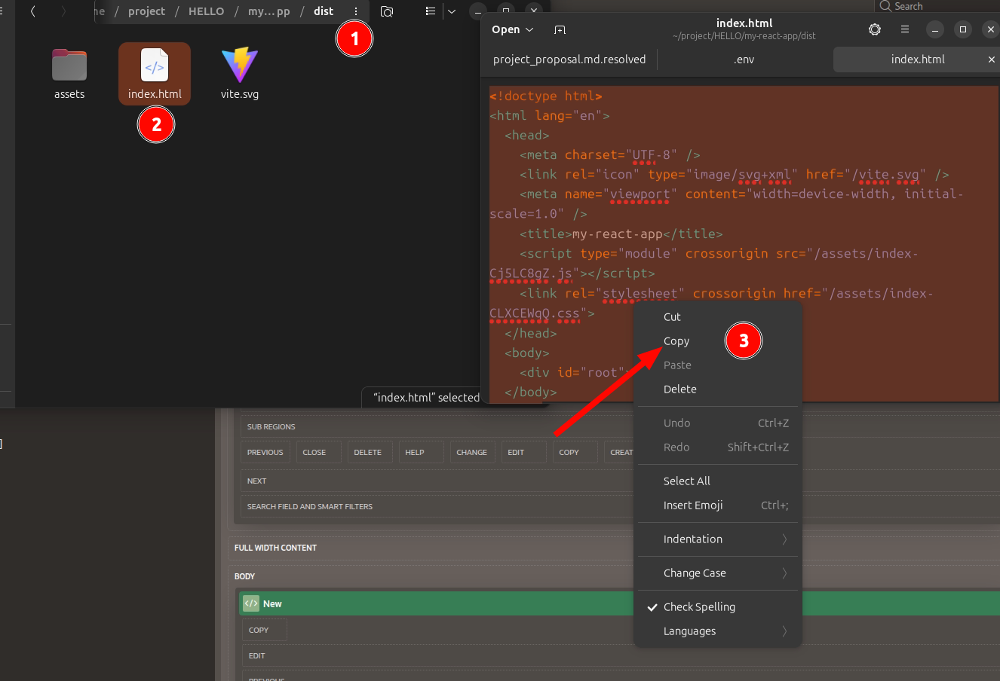

### Step 3.13 — Set Region Template

Set the region **Template** to **Blank with Attributes** for a clean layout.

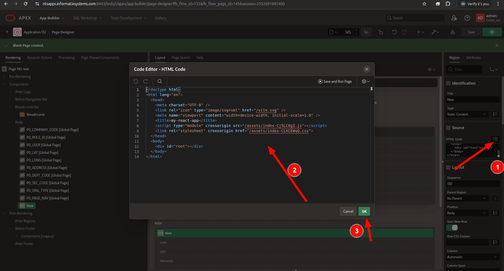

---

### Step 3.14 — Add CSS & JS File References

In Page Designer, select the page root, then:

**CSS → File URLs:**

Paste the CSS reference path you copied in Step 3.8:

```
#APP_FILES#index-XXXXXXXX.css
```

**JavaScript → File URLs:**

Paste the JS reference path you copied in Step 3.7:

```
#APP_FILES#index-XXXXXXXX.js
```

> **Important:** The JS file must load as `type="module"`.

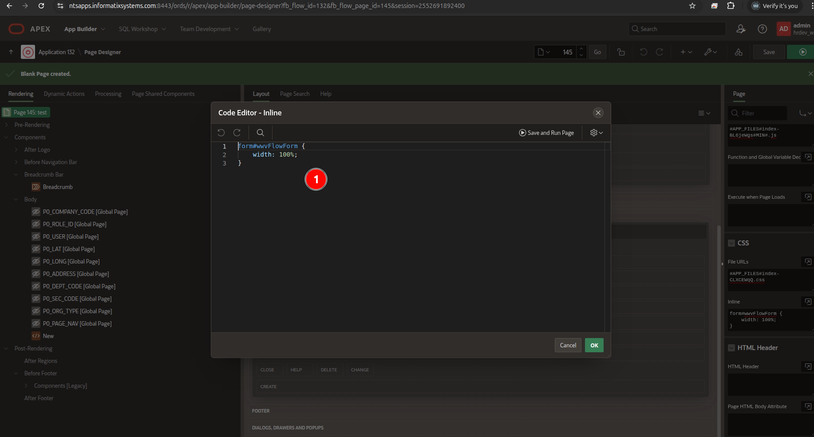

### Alternative: Load JS via Inline Code

If `type="module"` is not supported in File URLs, use **Execute when Page Loads**:

```javascript
var script = document.createElement('script');
script.type = 'module';
script.crossOrigin = 'anonymous';
script.src = apex.env.APP_FILE_PREFIX + 'index-XXXXXXXX.js';
document.head.appendChild(script);
```

---

### Step 3.15 — Save and Run

Save the page (`Ctrl+S`) and click **Run Page** to see the React app inside APEX.

---

## 4. Updating the App

1. Make code changes
2. Run `npm run build` (or `bun run build`)
3. Delete old files from **Static Application Files**
4. Upload new files from `dist/assets/`
5. Update file references in Page Designer (if filenames changed)
6. Save and run

---

## 5. Troubleshooting

| Issue | Solution |
|-------|----------|
| React app not rendering | Check browser console (F12). Ensure `<div id="root"></div>` exists and JS loads as `type="module"` |
| CORS errors | ORDS APIs must allow requests from your APEX domain |
| Employee links not working | App reads session from `apex.env.APP_SESSION` — only works inside APEX |
| Styles look broken | Set region template to **Blank with Attributes** to avoid APEX theme conflicts |
| Page reloads on button click | All buttons use `type="button"` and `e.preventDefault()` — should not happen |

---

## Project Structure

```
src/
├── App.jsx              ← Main app with tree view, search, tabs
├── App.css              ← Main styles
├── main.jsx             ← React entry point
├── components/
│   ├── OrgChart.jsx     ← Hierarchy chart + employee panel
│   └── OrgChart.css     ← Chart styles
```

## Tech Stack

- **React** 19 + **Vite** 7
- **Oracle ORDS** REST APIs
- **Oracle APEX** for hosting
