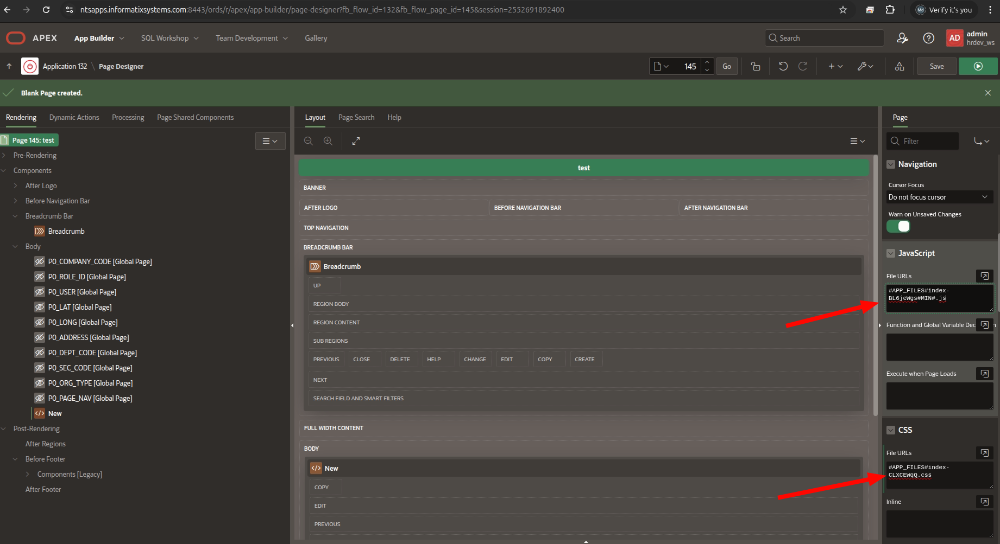
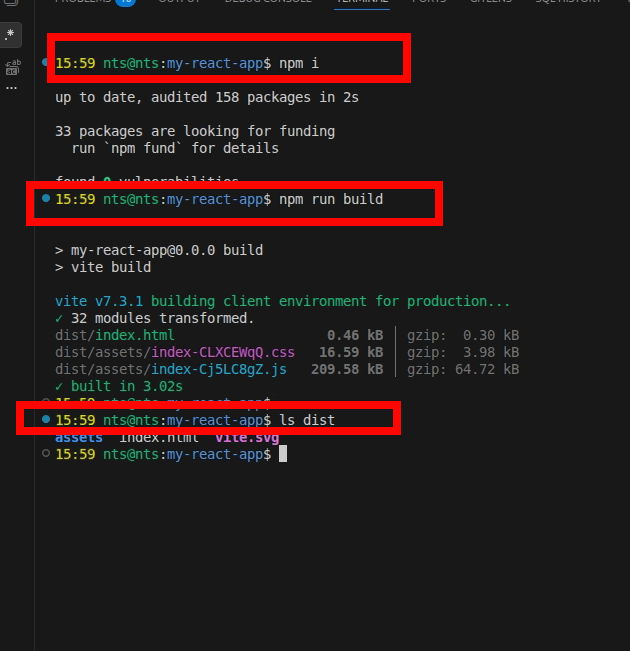

# Integrating React App into Oracle APEX — Step-by-Step Guide

This guide walks you through deploying a Vite + React application inside an Oracle APEX page. The React app (Organization Hierarchy) will be embedded as a static region using APEX static files.

---

## Table of Contents

1. [Prerequisites](#1-prerequisites)
2. [Build the React App](#2-build-the-react-app)
3. [Upload Static Files to APEX](#3-upload-static-files-to-apex)
4. [Create an APEX Page](#4-create-an-apex-page)
5. [Add a Static Content Region](#5-add-a-static-content-region)
6. [Add CSS File Reference](#6-add-css-file-reference)
7. [Add JS File Reference](#7-add-js-file-reference)
8. [Configure Page Settings](#8-configure-page-settings)
9. [Run and Test](#9-run-and-test)
10. [Updating the App](#10-updating-the-app)
11. [Troubleshooting](#11-troubleshooting)

---

## 1. Prerequisites

Before starting, ensure you have:

- Oracle APEX workspace with admin/developer access
- Node.js (v18+) and npm/bun installed locally
- The React project cloned and dependencies installed
- Access to **Shared Components > Static Application Files** in your APEX app

---

## 2. Build the React App

First, build the production bundle. The build output goes into the `dist/` folder.

```bash
# Navigate to the React project
cd my-react-app

# Install dependencies (if not done)
npm install
# or
bun install

# Build for production
npm run build
# or
bun run build
```

After building, the `dist/` folder will contain:

```
dist/
├── assets/
│   ├── index-XXXXXXXX.js    ← Main JavaScript bundle
│   └── index-XXXXXXXX.css   ← Main CSS stylesheet
├── index.html
└── vite.svg
```

> **Important:** The filenames contain a hash (e.g., `index-Cj5LC8gZ.js`). This changes on each build. You'll need to note these exact filenames when uploading to APEX.

---

## 3. Upload Static Files to APEX

### Step 3.1 — Open Shared Components

Navigate to your APEX application and go to **Shared Components**.


### Step 3.2 — Go to Static Application Files

Under **Files and Reports**, click on **Static Application Files**.


### Step 3.3 — Upload the JS File

Click **Upload File** (or **Create File**) and upload the JavaScript bundle from `dist/assets/`:

- **File:** `dist/assets/index-XXXXXXXX.js`
- **MIME Type:** `application/javascript` (should auto-detect)


### Step 3.4 — Upload the CSS File

Similarly, upload the CSS file:

- **File:** `dist/assets/index-XXXXXXXX.css`
- **MIME Type:** `text/css` (should auto-detect)


### Step 3.5 — Verify Uploaded Files

After uploading, you should see both files listed in Static Application Files. Note the reference paths — they will look like:

```
#APP_FILES#index-XXXXXXXX.js
#APP_FILES#index-XXXXXXXX.css
```


---

## 4. Create an APEX Page

### Step 4.1 — Create a New Blank Page

Go to **App Builder** → your application → click **Create Page** → choose **Blank Page**.


### Step 4.2 — Set Page Properties

Give the page a name (e.g., "Organization Hierarchy") and page number.


---

## 5. Add a Static Content Region

### Step 5.1 — Add a Region

In Page Designer, right-click on **Body** (under Content) → **Create Region**.


### Step 5.2 — Configure the Region

Set the region properties:

- **Title:** `Organization Hierarchy` (or leave blank)
- **Type:** `Static Content`
- **Source > HTML Code:**

```html
<div id="root"></div>
```

This `<div id="root">` is where React will mount the app.


### Step 5.3 — Set Region Template

Optionally, set the region **Template** to **Blank with Attributes** (or any minimal template) for a clean look without extra APEX styling around the React app.


---

## 6. Add CSS File Reference

### Step 6.1 — Page Properties > CSS

In Page Designer, select the page root (click on the page name at the top of the rendering tree), then go to the **CSS** section in the property editor.

In **CSS > File URLs**, add:

```
#APP_FILES#index-XXXXXXXX.css
```

Replace `XXXXXXXX` with the actual hash from your build.


---

## 7. Add JS File Reference

### Step 7.1 — Page Properties > JavaScript

In the same page properties, go to the **JavaScript** section.

In **JavaScript > File URLs**, add:

```
#APP_FILES#index-XXXXXXXX.js
```

> **Important:** Make sure to add the `type="module"` attribute. In APEX 23.1+, you can set this in the File URL field. In older versions, you may need to use inline code instead (see alternative below).


### Alternative: Load JS via Inline Code

If `type="module"` is not supported in the File URLs field, use **JavaScript > Execute when Page Loads** or the **Function and Global Variable Declaration** section:

```javascript
// In "Execute when Page Loads" or inline HTML:
var script = document.createElement('script');
script.type = 'module';
script.crossOrigin = 'anonymous';
script.src = apex.env.APP_FILE_PREFIX + 'index-XXXXXXXX.js';
document.head.appendChild(script);
```


---

## 8. Configure Page Settings

### Step 8.1 — Page Template

For a full-width layout, you can optionally change the page **Page Template** to a minimal template.



### Step 8.2 — Save and Run

Save the page by clicking **Save** (or `Ctrl+S`).


---

## 9. Run and Test

Click **Run Page** (the green play button) to test the React app inside APEX.

You should see the Organization Hierarchy app rendered inside the APEX page with:

- Tree View / Hierarchy Chart toggle
- Search functionality
- Clickable employee cards that redirect to employee detail pages (using the APEX session)



---

## 10. Updating the App

When you make changes to the React code and need to update APEX:

1. **Rebuild** the React app:
   ```bash
   npm run build
   ```

2. **Delete** the old JS and CSS files from **Shared Components > Static Application Files**

3. **Upload** the new files from `dist/assets/`

4. **Update** the file references in Page Designer (CSS File URLs and JS File URLs) with the new hash filenames

5. **Save** and **Run** the page

> **Tip:** To avoid updating filenames every time, you can configure Vite to produce consistent filenames:
>
> ```js
> // vite.config.js
> export default defineConfig({
>   plugins: [react()],
>   build: {
>     rollupOptions: {
>       output: {
>         entryFileNames: 'assets/app.js',
>         assetFileNames: 'assets/app.[ext]',
>       }
>     }
>   }
> })
> ```
>
> This produces `assets/app.js` and `assets/app.css` — no hash, so you never need to update the APEX references after the first setup.

---

## 11. Troubleshooting

### React app not rendering

- Check browser console (F12) for errors
- Verify `<div id="root"></div>` exists in the region HTML source
- Ensure JS file is loaded as `type="module"` — React/Vite bundles use ES modules

### CORS errors

- The ORDS REST API endpoints must allow requests from your APEX domain
- If APEX and ORDS are on the same domain/port, this should work automatically

### Session issues (employee links)

- The app reads the APEX session from `apex.env.APP_SESSION`
- If running outside APEX (standalone), the session parameter will be empty — links still work but may redirect to APEX login

### Styles conflicting with APEX theme

- The React app's CSS is scoped by class names and should not conflict
- If APEX theme overrides React styles, use more specific selectors or a CSS prefix
- Setting the region template to **Blank with Attributes** helps minimize conflicts

### Page reloads on button click

- All buttons in the React app use `type="button"` and `e.preventDefault()` to prevent form submission within APEX

---

## Quick Reference

| Item | Value |
|------|-------|
| React mount point | `<div id="root"></div>` |
| CSS reference | `#APP_FILES#index-XXXXXXXX.css` |
| JS reference | `#APP_FILES#index-XXXXXXXX.js` |
| JS type | `module` |
| APEX session access | `apex.env.APP_SESSION` |
| Build command | `npm run build` or `bun run build` |
| Output directory | `dist/assets/` |
